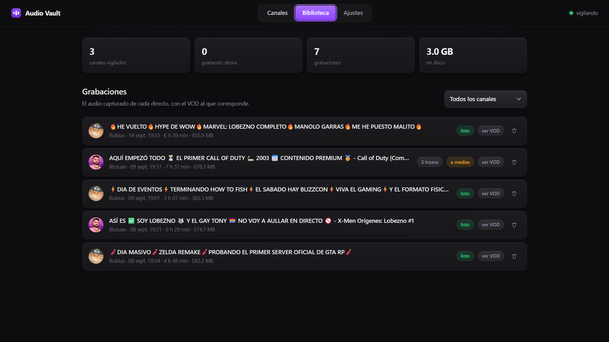
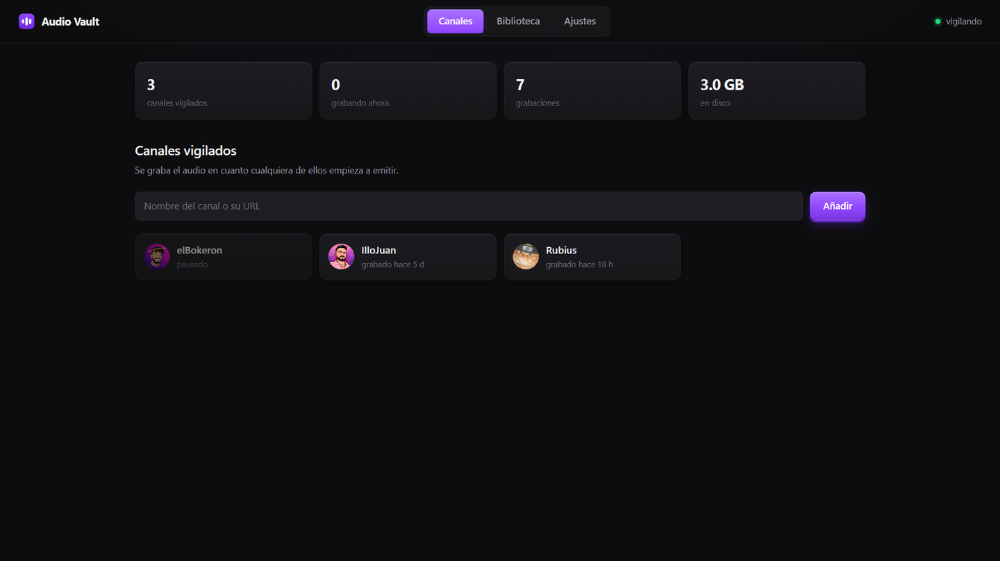
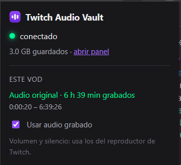

# Twitch Audio Vault

Extensión de Chrome que reproduce sobre los VOD de Twitch **el audio original del directo**.

Muchos streamers mandan a Twitch dos pistas de audio con la opción *VOD Track* de OBS: la del directo lleva la música, y la que Twitch guarda en el VOD no, para evitar el silenciado por copyright. Esa pista no se puede recuperar después desde Twitch; hay que grabarla mientras se emite. Un servidor propio la graba, y esta extensión la sincroniza sobre el VOD.



| Canales vigilados | La extensión sobre un VOD |
|---|---|
|  |  |

## Qué hace la extensión

- Detecta el VOD abierto en Twitch y pide al servidor el audio grabado de ese directo.
- Silencia el audio del VOD con un nodo de ganancia de **Web Audio** y reproduce encima el audio grabado, sincronizado.
- Sigue los saltos, pausas y cambios de velocidad del reproductor de Twitch.
- Popup y página de opciones para configurar la URL del servidor y un token opcional.

## Lo que costó

**Sincronizar sin fiarse del reloj.** El desfase entre directo y VOD se calcula con las marcas de tiempo del propio contenido (PTS en MPEG-TS, `tfdt` en MP4 fragmentado), no con la hora. Por reloj el error era de unos 13 segundos.

**Dos formatos a la vez.** Twitch entrega MPEG-TS o MP4 fragmentado según cómo emita cada streamer. En MP4 el `<audio>` no empieza a contar en cero: usa la línea temporal absoluta del contenido, así que la extensión suma un `origen` por tramo.

**Silenciar sin romper los controles de Twitch.** Con `video.muted` el botón de volumen de Twitch queda inservible. Con una ganancia de Web Audio a 0 los controles siguen funcionando.

**Saltos largos.** Ninguno de los dos formatos permite buscar rápido una posición, así que en cada salto largo se pide un recorte al servidor. El criterio para decidirlo es si la posición está en `audio.buffered`, no si cae dentro de la duración del fichero.

**Cortes periódicos.** Los tramos se piden por ventanas; el servidor redondea el inicio a múltiplos de la granularidad del segmento, y no tenerlo en cuenta desfasaba el encadenado hasta 10 segundos.

## Instalación

1. `chrome://extensions` → activar **Modo de desarrollador**.
2. **Cargar descomprimida** → elegir la carpeta `extension`.
3. En las opciones, indicar la URL del servidor (por defecto `http://localhost:8710`) y el token si lo tiene.

Requiere el servidor de grabación, que está en [`servidor/`](servidor).

## Las dos partes

El proyecto son dos piezas que se hablan por HTTP. Cada una tiene su propio
README con los detalles.

| Carpeta | Qué es |
|---|---|
| [`extension/`](extension) | La extensión de Chrome que reproduce el audio sobre el VOD |
| [`servidor/`](servidor) | El grabador en Python y su API — [README](servidor/README.md) |

El servidor vigila los canales y graba el audio de los directos; la extensión se
lo pide y lo sincroniza sobre el VOD. Sin servidor la extensión no tiene nada
que reproducir.

## Estructura

```
extension/
  manifest.json   Manifest V3
  content.js      integración con el reproductor de Twitch y sincronización
  background.js   service worker: peticiones al servidor
  puente.js       conecta la extensión con la web del servidor
  popup.*         estado y controles rápidos
  opciones.*      configuración

servidor/
  run.py          arranque
  vault/          grabador, API y lectura de los formatos de Twitch
  web/            panel de control
  despliegue/     guía e instalador para un servidor Linux
```

---

Iván Sola Rodríguez · [ivsola04@gmail.com](mailto:ivsola04@gmail.com)
